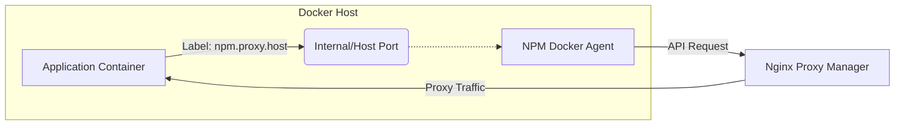

# NPM Docker Agent

[](https://github.com/rokelvisar/npm-agent/actions/workflows/publish.yml)
[](https://opensource.org/licenses/MIT)

An automated bridge between Docker container labels and Nginx Proxy Manager (NPM). This agent monitors the Docker daemon for container lifecycle events and automatically manages proxy hosts in your NPM instance based on container labels.

## Core Features

- **Zero-Touch Configuration**: Manage your reverse proxy directly from your `docker-compose.yml`.
- **Automatic SSL**: Support for automated Let's Encrypt certificates via NPM.
- **Dynamic Port Detection**: Automatically detects mapped host ports or uses internal container IPs.
- **Self-Healing**: Automatically cleans up proxy hosts when containers are removed.
- **Lightweight**: Built on Alpine Linux with minimal footprint.
- **Monitoring Dashboard**: Simple built-in dashboard for status overview.

## Architecture



## Prerequisites

- **Nginx Proxy Manager**: A running instance of [Nginx Proxy Manager](https://nginxproxymanager.com/).
- **Docker Socket Access**: The agent needs read access to `/var/run/docker.sock`.

## Configuration

### Environment Variables

| Variable | Description | Required | Default |
|----------|-------------|----------|---------|
| `NPM_API_BASE_URL` | Base URL of your NPM instance (e.g., `https://npm.example.com`) | Yes | - |
| `NPM_API_USER` | Admin email for NPM | Yes | - |
| `NPM_API_PASSWORD` | Admin password for NPM | Yes | - |
| `NPM_DEFAULT_LE_EMAIL` | Default email for Let's Encrypt certificates | No | - |
| `NPM_DEFAULT_FORWARD_HOST` | Fallback IP/Host to forward traffic to | No | Container IP |

### Container Labels

To expose a container, add the following labels:

| Label | Description | Default |
|-------|-------------|---------|
| `npm.proxy.host` | Comma-separated domains (e.g., `app.example.com`) | **Required** |
| `npm.proxy.port` | Internal container port to forward to | `80` |
| `npm.proxy.scheme` | Protocol (`http` or `https`) | `http` |
| `npm.proxy.ssl` | Whether to force SSL & request LE cert (`true`/`false`) | `true` |
| `npm.proxy.forward_host` | Override forward host for this specific container | Env default |

## Deployment

### Full Stack Example (NPM + Agent + App)

This example shows how to run Nginx Proxy Manager along with the Agent and a proxied application.

```yaml
services:
  # Nginx Proxy Manager
  npm:
    image: 'jc21/nginx-proxy-manager:latest'
    container_name: npm
    restart: unless-stopped
    ports:
      - '80:80'
      - '443:443'
      - '81:81'
    volumes:
      - ./data:/data
      - ./letsencrypt:/etc/letsencrypt

  # NPM Docker Agent
  npm-agent:
    image: ghcr.io/rokelvisar/npm-agent:main
    container_name: npm-agent
    restart: unless-stopped
    volumes:
      - /var/run/docker.sock:/var/run/docker.sock:ro
    environment:
      - NPM_API_BASE_URL=http://npm:81
      - NPM_API_USER=admin@example.com
      - NPM_API_PASSWORD=changeme
      - NPM_DEFAULT_LE_EMAIL=admin@example.com

  # Example Application (Automatically Proxied)
  whoami:
    image: traefik/whoami
    container_name: whoami
    labels:
      - "npm.proxy.host=whoami.example.com"
      - "npm.proxy.port=80"
      - "npm.proxy.ssl=true"
```

## Security

- **Socket Access**: Mount the Docker socket as read-only (`:ro`).
- **Non-Root**: The container runs as a non-privileged user.
- **Network**: Ensure the agent can reach both the Docker socket and the NPM API.

## License

This project is licensed under the MIT License - see the [LICENSE](LICENSE) file for details.
