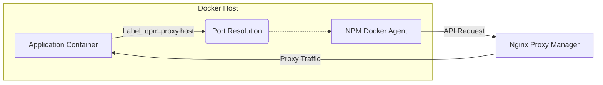

# NPM Docker Agent

[](https://github.com/rokreativa/npm-agent/actions/workflows/publish.yml)
[](https://opensource.org/licenses/MIT)

An automated bridge between Docker container labels and Nginx Proxy Manager (NPM). This agent monitors the Docker daemon for container lifecycle events and automatically manages proxy hosts in your NPM instance based on container labels.

## Core Features

- **Zero-Touch Configuration**: Manage your reverse proxy directly from your `docker-compose.yml`.
- **Automatic SSL**: Support for automated Let's Encrypt certificates via NPM.
- **Smart Port Detection**: Automatically resolves whether `npm.proxy.port` is a container-internal port or a host-mapped port, and picks the correct upstream (host gateway IP + host port, or container IP + internal port).
- **Self-Healing**: Automatically cleans up proxy hosts when containers are removed.
- **Lightweight**: Built on Alpine Linux with minimal footprint.
- **Monitoring Dashboard**: Simple built-in dashboard for status overview at `http://localhost:8080`.

## Architecture



## Prerequisites

- **Nginx Proxy Manager**: A running instance of [Nginx Proxy Manager](https://nginxproxymanager.com/).
- **Docker Socket Access**: The agent needs read access to `/var/run/docker.sock`.

## Configuration

### Environment Variables

| Variable | Description | Required | Default |
|----------|-------------|----------|---------|
| `NPM_API_BASE_URL` | Base URL of your NPM instance (e.g., `https://npm.example.com`) | Yes | — |
| `NPM_API_USER` | Admin email for NPM | Yes | — |
| `NPM_API_PASSWORD` | Admin password for NPM | Yes | — |
| `NPM_DEFAULT_LE_EMAIL` | Default email for Let's Encrypt certificates | No | — |
| `NPM_DEFAULT_FORWARD_HOST` | Override forward host for all containers | No | Auto-detected |
| `DOCKER_HOST` | Remote Docker daemon endpoint (e.g. `tcp://host:2375`) | No | Unix socket |

### Container Labels

| Label | Description | Default |
|-------|-------------|---------|
| `npm.proxy.host` | Comma-separated domains (e.g., `app.example.com`) | **Required** |
| `npm.proxy.port` | Port — container-internal **or** host-mapped (auto-detected) | `80` |
| `npm.proxy.scheme` | Protocol (`http` or `https`) | `http` |
| `npm.proxy.ssl` | Force SSL & request Let's Encrypt cert (`true`/`false`) | `true` |
| `npm.proxy.forward_host` | Override forward host for this container | Auto-detected |

### Port Resolution Logic

`npm.proxy.port` accepts either the **container-internal port** or the **host-mapped port** — the agent inspects Docker's port mapping table and figures out which one it is:

| Scenario | Label | Upstream used by NPM |
|----------|-------|----------------------|
| Container port `80` mapped to host `8089` | `npm.proxy.port=80` | `<host-gateway>:8089` |
| Container port `80` mapped to host `8089` | `npm.proxy.port=8089` | `<host-gateway>:8089` |
| No host port mapping (same Docker network) | `npm.proxy.port=80` | `<container-ip>:80` |

When a host port mapping is detected and no explicit `forward_host` is set, the agent uses the **Docker network gateway IP** (the host's IP as seen from inside the container) so NPM can reach the service via the host.

## Deployment

### Quick Start — `docker run`

Run the agent standalone, pointing it at an existing NPM instance:

```bash
docker run -d \
  --name npm-agent \
  --restart unless-stopped \
  -v /var/run/docker.sock:/var/run/docker.sock:ro \
  -p 8080:8080 \
  -e NPM_API_BASE_URL=http://npm.example.com:81 \
  -e NPM_API_USER=admin@example.com \
  -e NPM_API_PASSWORD=changeme \
  -e NPM_DEFAULT_LE_EMAIL=admin@example.com \
  ghcr.io/rokreativa/npm-agent:latest
```

> **Note:** If the Docker socket is permission-denied, add `--user root` to the command.

### Full Stack — `docker-compose.yml`

This example runs Nginx Proxy Manager, the agent, and a proxied application together:

```yaml
services:
  # Nginx Proxy Manager
  npm:
    image: 'jc21/nginx-proxy-manager:latest'
    container_name: npm
    restart: unless-stopped
    ports:
      - '80:80'
      - '443:443'
      - '81:81'
    volumes:
      - ./data:/data
      - ./letsencrypt:/etc/letsencrypt

  # NPM Docker Agent
  npm-agent:
    image: ghcr.io/rokreativa/npm-agent:latest
    container_name: npm-agent
    restart: unless-stopped
    depends_on:
      - npm
    volumes:
      - /var/run/docker.sock:/var/run/docker.sock:ro
    ports:
      - "8080:8080"   # Optional: dashboard
    environment:
      - NPM_API_BASE_URL=http://npm:81
      - NPM_API_USER=admin@example.com
      - NPM_API_PASSWORD=changeme
      - NPM_DEFAULT_LE_EMAIL=admin@example.com

  # Example Application (Automatically Proxied)
  whoami:
    image: traefik/whoami
    container_name: whoami
    ports:
      - "8089:80"   # host:8089 -> container:80
    labels:
      - "npm.proxy.host=whoami.example.com"
      - "npm.proxy.port=80"    # container-internal port; agent resolves to host:8089 automatically
      - "npm.proxy.ssl=true"
```

### Docker Socket Permission Issue

If you see `PermissionError: [Errno 13] Permission denied`, the agent can't access the Docker socket. Fix options:

**Option A — Run as root (simplest):**
```yaml
npm-agent:
  user: root
```
or with `docker run`:
```bash
docker run --user root ...
```

**Option B — Add the Docker group GID:**
```bash
# Find the GID of the docker socket group
stat -c '%g' /var/run/docker.sock
```
```yaml
npm-agent:
  user: "1000:999"   # Replace 999 with your docker GID
```

## Security

- **Socket Access**: Mount the Docker socket as read-only (`:ro`).
- **Non-Root**: The container defaults to a non-privileged user; use `user: root` only if needed.
- **Network**: Ensure the agent can reach both the Docker socket and the NPM API.

## License

This project is licensed under the MIT License - see the [LICENSE](LICENSE) file for details.
